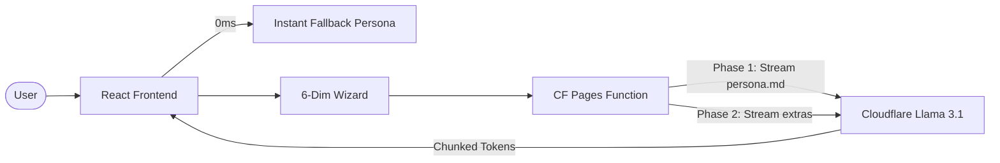

# 🤖 Persona Builder v2.1

> Create a premium AI Persona (`persona.md`) for Vibe-Coding using a natural-language 6-dimension deep personality analysis framework.

**🌐 Live:** [persona.autobahn.bot](https://persona.autobahn.bot)

---

## ✨ Features v2.1

| Feature | Description |
|---------|-------------|
| **2-Phase Streaming** | Generates `persona.md` instantly (2048 tokens), then processes Summary & Examples in the background. |
| **Instant Fallback** | Creates a functional template from user answers in 0ms, gracefully handling AI timeouts/errors. |
| **Tabbed Results UI** | Clean, organized display of persona.md, Summary, and Before/After Examples in isolated tabs. |
| **Browser Language Detection** | Automatically boots in English, Thai, or German based on OS/Browser preferred languages (`navigator.language`). |
| **Auto-Scroll Navigation** | Frictionless mobile experience; transitions automatically scroll to the top of the next question/step. |
| **Natural Language UX** | Rephrased questions and options to sound like real-life scenarios rather than academic theory. |
| **6-Dimension Analysis** | Deep mapping of Worldview, Perception, Agency, Taste, Persuasion, and Guardrails. |
| **Clone & Agent Modes** | Two distinct flows tailored for either mirroring human traits or defining exact specialist boundaries. |
| **Cloudflare AI Edge** | High-performance generation powered by **Llama 3.1 8B Instruct** via Cloudflare Workers AI. |

## 🛠️ Tech Stack

| Layer | Technology |
|-------|-----------|
| **Framework** | React 19 + Vite 6 |
| **Styling** | Tailwind CSS v4 |
| **Icons** | Lucide React |
| **AI Generation** | Cloudflare Workers AI (`@cf/meta/llama-3.1-8b-instruct`) |
| **Serverless** | Cloudflare Pages Functions (API Proxy) |
| **CI/CD** | GitHub Actions |

## 🚀 Getting Started

### Local Development

1.  **Clone the repository**:
    ```bash
    git clone https://github.com/bejranonda/PersonaBuilder.git
    cd PersonaBuilder
    ```

2.  **Install dependencies**:
    ```bash
    npm install
    ```

3.  **Set up environment variables**:
    Create a `.dev.vars` file for local proxy testing:
    ```bash
    CLOUDFLARE_ACCOUNT_ID=your_account_id
    CLOUDFLARE_API_TOKEN=your_api_token
    ```

4.  **Run the application**:
    - **Frontend Only**: `npm run dev` (Vite dev server)
    - **Full Stack (Recommended)**: `npm run pages:dev` (Wrangler proxy dev)

### Production Build

```bash
npm run build
npm run preview
```

## ☁️ Deployment (CI/CD)

The project includes pre-configured **GitHub Actions** for seamless deployment:

### 1. Cloudflare Pages Deployment
Pushing to the `master` branch triggers `.github/workflows/deploy.yml`. It builds the app and deploys it to Cloudflare Pages automatically.

**Required Secrets:**
- `CLOUDFLARE_API_TOKEN`: API token with "Cloudflare Pages Edit" permission.
- `CLOUDFLARE_ACCOUNT_ID`: Your Cloudflare account ID.

### 2. Automatic Releases
Pushing a tag (e.g., `git push origin v1.0.1`) triggers `.github/workflows/release.yml`, which creates a new GitHub Release with automated notes.

## 📐 Architecture & Logic



- **Frontend**: A state-driven React app that manages the multi-step branching questionnaire.
- **API Proxy**: A Cloudflare Pages Function (`/api/generate`) that securely handles authentication with the Cloudflare API.
- **6 Dimensions**: A proprietary framework that defines an AI's behavior across Worldview, Perception, Agency, Taste, Persuasion, and Guardrails.

## 📚 Documentation

Detailed documentation is available in the `knowledge/` directory:

| Document | Purpose |
|----------|---------|
| [**Approach & Method**](knowledge/approach_and_method.md) | Deep dive into the 6-dimension framework and design philosophy. |
| [**Developer Guideline**](knowledge/guideline.md) | Technical guide for extending languages, prompts, and local dev. |
| [**Known Issues**](knowledge/known-issues.md) | Tracked limitations, model quirks, and planned improvements. |

## 📄 License

MIT
