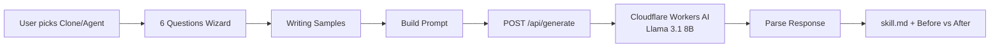

# 🤖 Persona Builder

> Build an AI Persona (`skill.md`) for Vibe-Coding using a 6-dimension deep personality analysis framework.

**🌐 Live:** [persona.autobahnn.bot](https://persona.autobahnn.bot)

---

## ✨ Features

| Feature | Description |
|---------|-------------|
| **Multi-language** | Full TH 🇹🇭, EN 🇬🇧, DE 🇩🇪 support across UI, wizard, and AI output |
| **6-Dimension Analysis** | Worldview, Perception, Agency, Taste, Persuasion, Guardrails |
| **Clone Mode** | Reverse-engineer *your own* personality into an AI persona |
| **Agent Mode** | Design a purpose-built AI Agent from scratch |
| **Writing Samples** | Paste real text from Facebook, LinkedIn, etc. for style matching |
| **Cloudflare AI** | Powered by Llama 3.1 8B Instruct (free-tier), with automatic fallback |
| **Before vs After** | Instant comparison showing how a generic sentence transforms with the persona |
| **Download & Copy** | Export the generated `skill.md` with one click |

## 🛠️ Tech Stack

| Layer | Technology |
|-------|-----------|
| Framework | React 19 + Vite 6 |
| Styling | Tailwind CSS v4 (via `@tailwindcss/vite`) |
| Icons | Lucide React |
| Localization | Custom lightweight dictionary-based i18n (`src/lib/i18n.js`) |
| AI Model | Cloudflare Workers AI — `@cf/meta/llama-3.1-8b-instruct` (fallback: `llama-3-8b-instruct`) |
| Hosting | Cloudflare Pages |
| API Proxy | Cloudflare Pages Functions (`functions/api/generate.js`) |
| Persistence | `localStorage` for language preference |

## 🚀 Getting Started

### Prerequisites

- Node.js 18+
- npm (or pnpm)

### Install & Run (Client Only)

```bash
npm install
npm run dev          # Vite dev server at http://localhost:5173
```

> ⚠️ AI generation requires the Cloudflare Functions proxy. Use `pages:dev` for the full experience.

### Run with Cloudflare Functions Proxy

```bash
# 1. Create .dev.vars with your credentials
#    CLOUDFLARE_API_TOKEN=cfut_...
#    CLOUDFLARE_ACCOUNT_ID=69...

# 2. Start with wrangler
npm run pages:dev
```

### Production Build

```bash
npm run build        # Output → dist/
npm run preview      # Preview locally
```

## ☁️ Deployment (Cloudflare Pages)

### 1. Connect Repository

Link this GitHub repo to Cloudflare Pages:
- **Build command:** `npm run build`
- **Output directory:** `dist`
- **Node version:** 18+

### 2. Set Environment Variables

In Cloudflare Pages → Settings → Environment Variables:

| Variable | Value | Required |
|----------|-------|----------|
| `CLOUDFLARE_API_TOKEN` | Your Cloudflare API token | ✅ |
| `CLOUDFLARE_ACCOUNT_ID` | Your Cloudflare account ID | ✅ |

### 3. Custom Domain

Configure `persona.autobahnn.bot` in Cloudflare Pages → Custom Domains.

## 📐 Architecture

```
persona-builder/
├── index.html                  # Vite HTML entry point
├── package.json                # Dependencies & scripts
├── vite.config.js              # Vite + Tailwind + React plugins
│
├── src/
│   ├── main.jsx                # React DOM root
│   ├── index.css               # Tailwind imports + custom animations
│   ├── App.jsx                 # Main app — wizard UI, language toggle, result view
│   ├── data/
│   │   └── questionFlow.js     # 6-dimension question trees (TH/EN/DE) + PLATFORMS
│   └── lib/
│       ├── api.js              # Retry-capable fetch client for /api/generate
│       └── i18n.js             # DICTIONARY object (TH/EN/DE UI strings)
│
├── functions/
│   └── api/
│       └── generate.js         # Cloudflare Pages Function — proxies Workers AI
│
├── knowledge/
│   ├── approach_and_method.md  # Design rationale & framework explanation
│   ├── guideline.md            # Developer guide for extending the app
│   └── known-issues.md         # Tracked bugs & workarounds
│
└── .gitignore                  # Excludes .env, .dev.vars, research/, dist/
```

## 🔄 How It Works



1. **Step 1** — Choose Clone (mimic yourself) or Agent (design from scratch)
2. **Step 2** — Answer one question per dimension (6 total, branching tree)
3. **Step 3** — Paste writing samples for style calibration (optional but recommended)
4. **Step 4** — AI generates `skill.md` + a Before vs After comparison example

## 📚 Documentation

| Document | Path | Purpose |
|----------|------|---------|
| Approach & Method | `knowledge/approach_and_method.md` | Why 6 dimensions, why Cloudflare AI, why custom i18n |
| Developer Guide | `knowledge/guideline.md` | How to add languages, modify prompts, deploy |
| Known Issues | `knowledge/known-issues.md` | Tracked bugs, workarounds, model limitations |

## 📄 License

MIT
